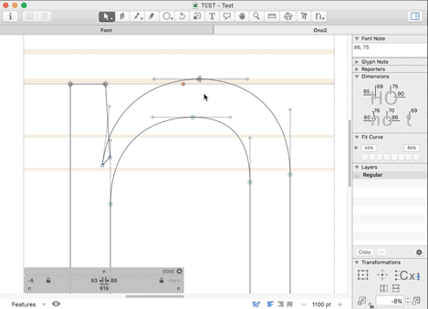
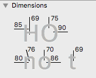
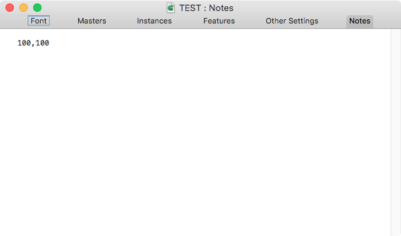

# GaugeTool.glyphsTool

This is a plugin for [Glyphs App](http://glyphsapp.com/). Shout out to [Dinamo](http://www.dinamo.us) for the idea and Georg Seifert (@schriftgestalt) for sample code and assistance!

The tool shows an oval for a mouse cursor which can be used to gauge the width of strokes. The size of this oval is set in the dimensions palette and the Notes tab in the Font Info window.

 

#### Lowercase
There are 2 tools nested under each other, the 'n' and 'o' tool, which uses their respective values in the dimensions palette for lowercase letters. (To change tools, press Shift+C). 'n' is blue while 'o' is green.

#### Uppercase
It will detect uppercase letters and uses only the 'O' dimensions. This is the same for the 'n' and 'o' tool.

#### Other glyphs
If it is neither lowercase or uppercase the tool will use the value set in the first line of the Notes parameter. Which can be set with the [Note Palette](https://github.com/mekkablue/NotePalettes) plugin:

or in the Font Info window:

When the tool is using the dimension palette measurements the circle is either blue (n) or green (o), otherwise if it is using the notes parameter value the circle is red.

After installation, it will show a tool in the tool palette.

### Usage Instructions

1. Open a glyph in Edit View.
2. Enter your font's measurements in the Dimensions palette, for 'O', 'n' and 'o'. Also enter a value in the Notes parameter for backup dimensions.
3. Use C or Shift+C to toggle the tool.

### Installation

1. Download the complete ZIP file and unpack it, or clone the repository.
2. Double click the .glyphsTool file. Confirm the dialog that appears in Glyphs.
3. Restart Glyphs

### Requirements

The plugin needs Glyphs 2.0 or higher, running on OS X 10.9 or later. It does NOT work with Glyphs 1.x.

### License

2016 Wei Huang (@weiweihuanghuang).
Based on sample code by Georg Seifert (@schriftgestalt).
Idea from [Dinamo](http://www.dinamo.us).

Licensed under the Apache License, Version 2.0 (the "License");
you may not use this file except in compliance with the License.
You may obtain a copy of the License at

http://www.apache.org/licenses/LICENSE-2.0

See the License file included in this repository for further details.